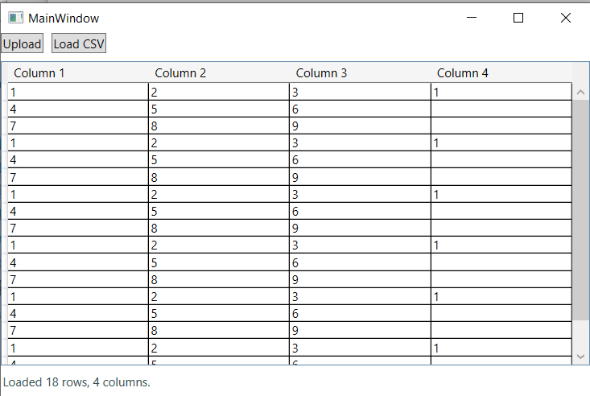
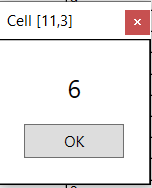
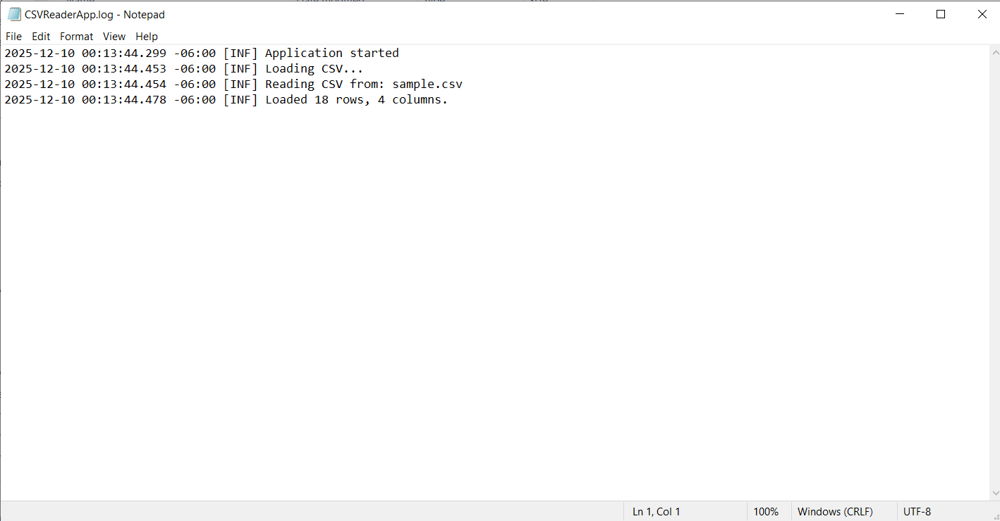

# CSV Reader Application

A Windows Presentation Foundation (WPF) application for reading and viewing CSV files with an user interface.

##  Description

This application provides a simple and efficient way to load, view, and interact with CSV (Comma-Separated Values) files. Built with .NET 8 and WPF, it demonstrates modern C# programming practices including MVVM pattern, error handling, and comprehensive logging.

## Features
- **CSV File Loading**: Automatically loads a sample CSV file on startup
- **File Browser**: Browse and select any CSV file from your system
- **Interactive Grid**: View CSV data in a clean, responsive DataGrid
- **Cell Details**: Double-click any cell to view its value in a popup window
- **Error Logging**: Comprehensive error logging to Desktop (`CSVReaderApp.log`)

## Screenshots

### Main Window

### Cell Detail Popup

### Logging

### Main Window
The application displays CSV data in a grid format with Upload and Load CSV buttons.

### Cell Detail Window
Double-clicking a cell opens a popup showing the cell's position and value (e.g., "Cell [1,2]").

##  Technical Stack

- **.NET 8** - Target framework
- **WPF** - Windows Presentation Foundation
- **C# ** - Programming language
- **MVVM Pattern** - Model-View-ViewModel architecture
- **Serilog** - Logging framework

## Technical Stack

- **.NET 8.0** - Target framework
- **WPF** - Windows Presentation Foundation
- **C#** - Programming language
- **MVVM Pattern** - Model-View-ViewModel architecture
- **Serilog** - Logging framework

## NuGet Packages
- `Serilog 4.3.0` - Structured logging
- `Serilog.Sinks.File 7.0.0` - File output for logs

### Prerequisites
- .NET 8.0 SDK or later
- Visual Studio 2022 (recommended) or any compatible IDE

